# LLM Fine-Tuning & Preference Optimization

## 1. Project Overview

This project demonstrates how to take a capable open-source Large Language Model (LLM) and make it **consistently reliable at a narrow, measurable task** through supervised fine-tuning and preference optimization.

The project is intentionally designed around an important engineering principle:

> Fine-tuning is not primarily about making a model generally smarter. It is about making an existing model more consistent, accurate, and controllable for a clearly defined task where prompt engineering alone does not reliably meet the required quality level.

The system begins by establishing the best achievable **base-model + prompt-engineering baseline**. Fine-tuning is introduced only after a measurable gap has been demonstrated.

Two particularly suitable task families are supported:

1. **Structured JSON extraction from messy unstructured text**
2. **Tool/function calling accuracy**

These tasks are ideal because improvement can be measured objectively using metrics such as JSON validity, schema compliance, exact-match accuracy, function-selection accuracy, parameter accuracy, and refusal correctness.

We can proceed with two training stages:

- **Phase 1 — Supervised Fine-Tuning (SFT)** using LoRA or QLoRA
- **Phase 2 — Preference Optimization** using Direct Preference Optimization (DPO)

The final output is not simply a trained model. The project delivers a complete engineering workflow covering:

- problem definition,
- baseline benchmarking,
- dataset design,
- data validation,
- supervised fine-tuning,
- parameter-efficient training,
- preference-data construction,
- DPO,
- evaluation,
- experiment tracking,
- model versioning,
- deployment,
- monitoring,
- failure analysis,
- and a technical report containing before/after evidence.

---

# 2. Why LLM Fine-Tuning & Preference Optimization Matters

Many AI portfolio projects stop at prompt engineering or Retrieval-Augmented Generation. Fine-tuning demonstrates a different class of capability: the ability to modify model behavior through controlled post-training.

A production-grade fine-tuning project should answer the following questions:

- Why is fine-tuning needed?
- What problem cannot be solved reliably enough through prompting alone?
- How was the training dataset created?
- How was data quality verified?
- Which parts of the model were trained?
- Why was LoRA or QLoRA selected?
- Which hyperparameters were used?
- How was overfitting detected?
- How was the model evaluated?
- Did the fine-tuned model outperform the prompted base model?
- Did DPO improve the SFT model further?
- What failure cases remain?
- Can the resulting model be deployed and monitored reliably?

This project is therefore designed as an **end-to-end LLM post-training system**, rather than a notebook-only experiment.

---

# 3. Recommended Project Use Case

## Primary Use Case: Structured JSON Extraction

The model receives noisy or semi-structured text and must return a strictly defined JSON object.

Example input:

```text
Customer John Tan called regarding policy P-10231.
The policy should be cancelled effective 12 September 2026.
Reason: vehicle sold.
Customer requested confirmation by email.
```

Expected output:

```json
{
  "customer_name": "John Tan",
  "policy_number": "P-10231",
  "action": "cancel_policy",
  "effective_date": "2026-09-12",
  "reason": "vehicle sold",
  "send_confirmation": true
}
```

The challenge is not producing a plausible answer. The challenge is producing a **consistently valid, schema-compliant answer** across thousands of differently formatted inputs.

Typical baseline problems include:

- invalid JSON,
- incorrect field names,
- missing required fields,
- invented values,
- inconsistent date formats,
- unnecessary prose around JSON,
- incorrect refusal behavior,
- failure to distinguish missing information from negative values.

These failure modes are measurable, which makes this an excellent fine-tuning use case.

---

# 4. Alternative Use Case: Tool / Function Calling

The same architecture can be applied to tool-selection accuracy.

Example user input:

```text
Cancel policy P-10231 from next Monday and notify the customer.
```

Available tools:

```json
[
  {
    "name": "cancel_policy",
    "parameters": {
      "policy_number": "string",
      "effective_date": "string"
    }
  },
  {
    "name": "send_notification",
    "parameters": {
      "policy_number": "string",
      "channel": "string"
    }
  }
]
```

Expected model behavior:

```json
{
  "tool": "cancel_policy",
  "arguments": {
    "policy_number": "P-10231",
    "effective_date": "2026-09-28"
  }
}
```

Tool-calling evaluation can measure:

- correct tool selection,
- correct argument names,
- correct argument values,
- missing required parameters,
- unnecessary tool calls,
- invalid parameter hallucination,
- correct refusal or clarification behavior.

---

# 5. Project Goals

The project should demonstrate the following technical capabilities:

1. Establish a rigorous prompted baseline before training.
2. Build a clean task-specific dataset.
3. Implement automated dataset validation.
4. Fine-tune an open-source LLM using SFT.
5. Use LoRA or QLoRA for parameter-efficient training.
6. Evaluate the model on a held-out test set.
7. Build preference pairs from good and bad responses.
8. Apply DPO to the SFT model.
9. Compare Base vs Prompted Base vs SFT vs DPO.
10. Track experiments and training curves.
11. Package the resulting model for inference.
12. Expose it through a production-style API.
13. Monitor inference quality and operational metrics.
14. Produce a technical report showing measurable improvement and lessons learned.

---

# 6. High-Level Architecture

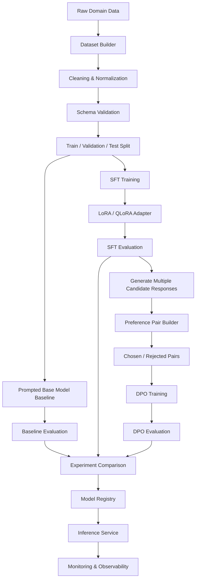

---

# 7. System Design

The solution is divided into seven major layers.

## 7.1 Data Layer

Responsible for collecting, cleaning, transforming, validating, and versioning training data.

Components:

- raw dataset storage,
- dataset normalization,
- duplicate detection,
- schema validator,
- quality rules,
- label consistency checks,
- train/validation/test splitting,
- preference-pair construction.

Recommended dataset size for the first production-style experiment:

```text
2,000 – 10,000 high-quality examples
```

A smaller clean dataset is preferable to a larger inconsistent dataset.

Data quality should be treated as a first-class engineering concern.

---

## 7.2 Baseline Evaluation Layer

Before fine-tuning, the best possible prompt should be developed for the base model.

Example:

```text
Base Model
   │
   ▼
System Prompt
   │
   ▼
Few-Shot Examples
   │
   ▼
Strict Output Schema
   │
   ▼
Validation / Retry
   │
   ▼
Baseline Metrics
```

The purpose is to answer:

> Can prompt engineering already solve the problem?

If the prompted base model already achieves the required acceptance threshold, fine-tuning may not be justified.

The fine-tuning project becomes valuable when a repeatable gap remains.

Example:

| Metric | Target | Prompted Base |
|---|---:|---:|
| JSON validity | >= 99.5% | 94.1% |
| Schema compliance | >= 99% | 91.8% |
| Exact match | >= 95% | 82.4% |
| Refusal correctness | >= 98% | 89.7% |

The values above are examples. The real project must report measured values from the evaluation dataset.

---

# 8. Base Model

A practical starting point is an open-source instruct or base model in the approximately 7B–8B parameter range.

Example candidate:

```text
Qwen3-8B
```

The exact model should be selected based on:

- license,
- task capability,
- context length,
- memory requirements,
- tokenizer behavior,
- tool-calling support,
- deployment requirements,
- inference cost,
- and target hardware.

A smaller model may also be used initially to validate the training pipeline before moving to a larger model.

---

# 9. Why LoRA / QLoRA?

Full fine-tuning updates all model parameters and can require substantial GPU memory.

Parameter-Efficient Fine-Tuning (PEFT) reduces this cost.

## LoRA

LoRA keeps the original model weights frozen and trains small low-rank adapter matrices.

Conceptually:

```text
Original Model Weights
        │
        │ frozen
        ▼
Transformer Layers
        │
        ├──── LoRA Adapter A
        │
        └──── LoRA Adapter B
                 │
                 ▼
         Trainable Parameters
```

Advantages:

- fewer trainable parameters,
- lower GPU memory usage,
- faster training,
- smaller artifacts,
- easier experimentation,
- multiple adapters can be maintained for different tasks.

---

## QLoRA

QLoRA combines low-rank adapters with a quantized base model, commonly using 4-bit model loading during training.

```text
Base Model
   │
   ▼
4-bit Quantization
   │
   ▼
Frozen Quantized Weights
   │
   +──── Trainable LoRA Adapters
   │
   ▼
Fine-Tuned Adapter
```

QLoRA is particularly useful when GPU memory is limited.

Actual feasibility depends on:

- model size,
- context length,
- batch size,
- gradient accumulation,
- optimizer,
- activation memory,
- precision,
- and GPU type.

The project should therefore record actual GPU memory consumption rather than assume a particular card will always be sufficient.

---

# 10. Phase 1 — Supervised Fine-Tuning

## 10.1 Objective

Teach the model the exact desired mapping:

```text
Input
  ↓
Correct Target Output
```

Example training record:

```json
{
  "messages": [
    {
      "role": "system",
      "content": "Extract the requested information and return valid JSON only."
    },
    {
      "role": "user",
      "content": "Customer John Tan wants policy P-10231 cancelled because the car was sold."
    },
    {
      "role": "assistant",
      "content": "{\"customer_name\":\"John Tan\",\"policy_number\":\"P-10231\",\"action\":\"cancel_policy\",\"reason\":\"vehicle sold\"}"
    }
  ]
}
```

---

## 10.2 Dataset Design

The dataset should deliberately contain different classes of examples.

Suggested composition:

| Category | Purpose |
|---|---|
| Normal examples | Common business inputs |
| Noisy examples | Typos, formatting issues, incomplete sentences |
| Long inputs | Test context handling |
| Missing-field examples | Teach null / clarification behavior |
| Ambiguous examples | Teach safe clarification |
| Negative examples | Inputs where no action should occur |
| Refusal examples | Teach when to decline |
| Edge cases | Dates, unusual IDs, special characters |
| Multi-action examples | Multiple possible tool calls |
| Adversarial examples | Prompt injection or malformed instructions |

---

# 11. Data Quality Pipeline

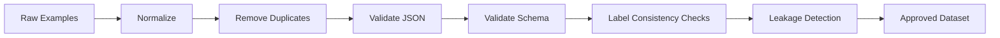

Automated checks should include:

- JSON parse validation,
- schema validation,
- required-field validation,
- allowed-value validation,
- canonical date formatting,
- duplicate detection,
- near-duplicate detection,
- inconsistent-label detection,
- prompt/response leakage detection,
- maximum sequence-length checks,
- personally identifiable information handling where applicable.

---

# 12. Train / Validation / Test Strategy

A typical split could be:

```text
Training:    80%
Validation:  10%
Test:        10%
```

The **test set must remain untouched during training**.

A stronger design also creates challenge slices:

```text
Test Set
 │
 ├── Normal Cases
 ├── Noisy Inputs
 ├── Missing Fields
 ├── Ambiguous Inputs
 ├── Refusal Cases
 ├── Long Inputs
 └── Adversarial Cases
```

Metrics should be reported both globally and per slice.

This prevents a high overall score from hiding poor performance on important edge cases.

---

# 13. Training Pipeline

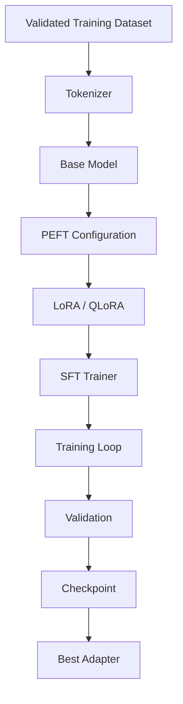

Recommended tooling:

- Python
- PyTorch
- Hugging Face Transformers
- Hugging Face Datasets
- Hugging Face PEFT
- Hugging Face TRL
- bitsandbytes where supported
- Accelerate
- Axolotl as an optional configuration-driven training framework

---

# 14. Example Training Configuration

Example experimental configuration:

```yaml
base_model: Qwen/Qwen3-8B

training:
  method: sft
  adapter: qlora
  load_in_4bit: true
  epochs: 3
  learning_rate: 0.0002
  micro_batch_size: 2
  gradient_accumulation_steps: 8
  max_sequence_length: 2048

lora:
  rank: 16
  alpha: 32
  dropout: 0.05

evaluation:
  strategy: steps
  save_best_model: true
```

These are starting values, not universal defaults.

Every important hyperparameter should be treated as an experiment.

---

# 15. Hyperparameters to Track

At minimum:

- base model,
- dataset version,
- random seed,
- LoRA rank,
- LoRA alpha,
- LoRA dropout,
- target modules,
- learning rate,
- scheduler,
- optimizer,
- epochs,
- batch size,
- gradient accumulation,
- max sequence length,
- weight decay,
- warmup,
- quantization configuration,
- precision,
- GPU type,
- training duration,
- peak GPU memory.

---

# 16. Training Curve

The project report should include training and validation loss.

Example:

```text
Loss
 ^
 |\
 | \
 |  \       Validation
 |   \______
 |          \__
 | Training   \___
 +--------------------> Steps
```

Important patterns to discuss:

### Healthy learning

Training and validation loss both improve.

### Underfitting

Both losses remain high.

Possible actions:

- increase epochs,
- adjust learning rate,
- improve dataset quality,
- increase adapter capacity.

### Overfitting

Training loss falls while validation performance degrades.

Possible actions:

- stop earlier,
- reduce epochs,
- increase regularization,
- reduce LoRA rank,
- improve dataset diversity.

The portfolio should explicitly discuss at least one failed or suboptimal experiment and explain the corrective action.

---

# 17. Evaluation Metrics

## 17.1 JSON Validity Rate

Percentage of outputs that can be parsed as JSON.

```text
Valid JSON Outputs
------------------- × 100
Total Outputs
```

---

## 17.2 Schema Compliance Rate

Percentage of outputs conforming to the required schema.

Checks may include:

- required properties,
- correct data types,
- valid enum values,
- no forbidden fields,
- correct date format.

---

## 17.3 Exact Match Accuracy

Useful for deterministic structured outputs.

```text
Exact Correct Outputs
--------------------- × 100
Total Outputs
```

Canonicalization should be performed when property ordering is irrelevant.

---

## 17.4 Field-Level Accuracy

Useful when exact match is too strict.

Example:

```text
customer_name     99.1%
policy_number     99.8%
action            98.7%
effective_date    96.4%
reason            94.9%
```

---

## 17.5 Tool Selection Accuracy

For tool-calling tasks:

```text
Correct Tool
------------ × 100
Total Calls
```

---

## 17.6 Parameter Accuracy

Measures whether the selected function was populated correctly.

Evaluate:

- parameter names,
- parameter values,
- required parameters,
- unwanted parameters.

---

## 17.7 Refusal Correctness

Measures whether the model correctly refuses or requests clarification when it should.

The metric should account for two error types:

```text
False Refusal
Model refuses when it should answer.

Unsafe / Incorrect Compliance
Model answers when it should refuse or clarify.
```

Both should be reported.

---

# 18. Phase 1 Evaluation

After SFT:

```text
Held-Out Test Set
      │
      ▼
Base Model + Best Prompt
      │
      ▼
Baseline Metrics

Held-Out Test Set
      │
      ▼
SFT Model
      │
      ▼
SFT Metrics
```

Example reporting format:

| Metric | Prompted Base | SFT | Change |
|---|---:|---:|---:|
| JSON validity | 94.1% | 99.6% | +5.5 pp |
| Schema compliance | 91.8% | 99.1% | +7.3 pp |
| Exact match | 82.4% | 94.8% | +12.4 pp |
| Refusal correctness | 89.7% | 97.2% | +7.5 pp |

These values are placeholders. Replace them with actual experiment results.

---

# 19. Phase 2 — Preference Optimization with DPO

Supervised training teaches:

> This is the desired answer.

Preference optimization teaches:

> Given two plausible answers, prefer this one over that one.

DPO uses preference pairs.

Example:

```json
{
  "prompt": "Extract the cancellation request.",
  "chosen": {
    "policy_number": "P-10231",
    "action": "cancel_policy"
  },
  "rejected": {
    "policy": "P-10231",
    "task": "cancel"
  }
}
```

The rejected answer may be plausible but inferior because it violates the required schema.

---

# 20. Preference Data Construction

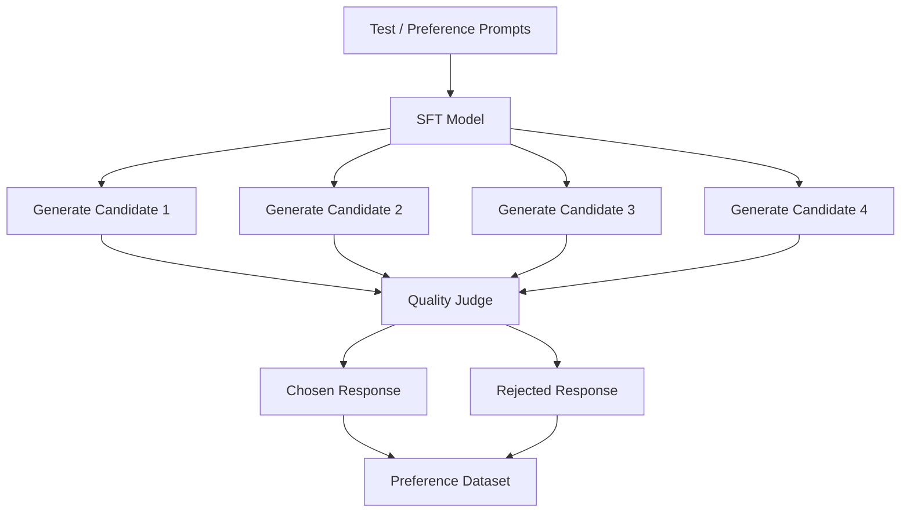

Candidates can be ranked using:

- deterministic validators,
- schema checks,
- domain rules,
- exact-match references,
- human reviewers,
- carefully designed LLM-assisted judging where appropriate.

For structured tasks, deterministic validation should be preferred whenever possible.

---

# 21. Preference Labels

A response should be preferred when it is:

1. factually correct,
2. schema compliant,
3. complete,
4. concise,
5. non-hallucinatory,
6. appropriately refusing or clarifying,
7. using the correct tool,
8. populating the correct parameters.

Preference examples should cover subtle differences rather than only obviously broken outputs.

---

# 22. DPO Training Pipeline

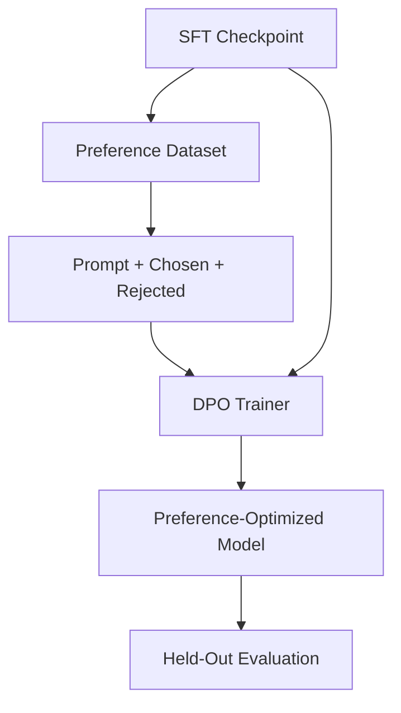

The SFT checkpoint becomes the starting point for DPO.

The stages are therefore stackable:

```text
Base Model
    │
    ▼
Prompt Engineering
    │
    ▼
Supervised Fine-Tuning
    │
    ▼
LoRA / QLoRA Adapter
    │
    ▼
Preference Dataset
    │
    ▼
DPO
    │
    ▼
Final Model
```

---

# 23. Final Evaluation Strategy

The final comparison should contain at least four systems:

```text
1. Raw Base Model
2. Base Model + Best Prompt
3. SFT Model
4. SFT + DPO Model
```

Example:

| Metric | Base | Prompted Base | SFT | SFT + DPO |
|---|---:|---:|---:|---:|
| JSON validity | TBD | TBD | TBD | TBD |
| Schema compliance | TBD | TBD | TBD | TBD |
| Exact match | TBD | TBD | TBD | TBD |
| Tool accuracy | TBD | TBD | TBD | TBD |
| Parameter accuracy | TBD | TBD | TBD | TBD |
| Refusal correctness | TBD | TBD | TBD | TBD |
| Hallucination rate | TBD | TBD | TBD | TBD |
| Avg latency | TBD | TBD | TBD | TBD |

The important result is not merely that the final model is better.

The report should show **where each training stage added value**.

---

# 24. Experiment Tracking

Every training run should be reproducible.

Recommended tools include:

- MLflow,
- Weights & Biases,
- TensorBoard,
- or an equivalent experiment tracker.

Track:

```text
Experiment
 │
 ├── Dataset Version
 ├── Model Version
 ├── Training Config
 ├── Hyperparameters
 ├── GPU
 ├── Training Loss
 ├── Validation Loss
 ├── Evaluation Metrics
 ├── Artifacts
 └── Notes / Failure Analysis
```

Example run names:

```text
qwen3-8b-sft-lora-r8-v1
qwen3-8b-sft-lora-r16-v2
qwen3-8b-qlora-r16-v3
qwen3-8b-qlora-r16-dpo-v1
```

---

# 25. Model Registry

Only models that pass the quality gate should be registered for deployment.

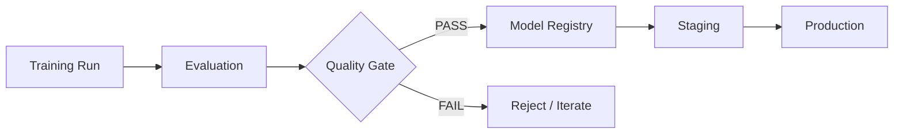

Suggested quality gate:

```yaml
quality_gate:
  json_validity: ">= 0.995"
  schema_compliance: ">= 0.990"
  exact_match: ">= 0.950"
  refusal_correctness: ">= 0.980"
```

Thresholds must be determined from business requirements.

---

# 26. Deployment Architecture

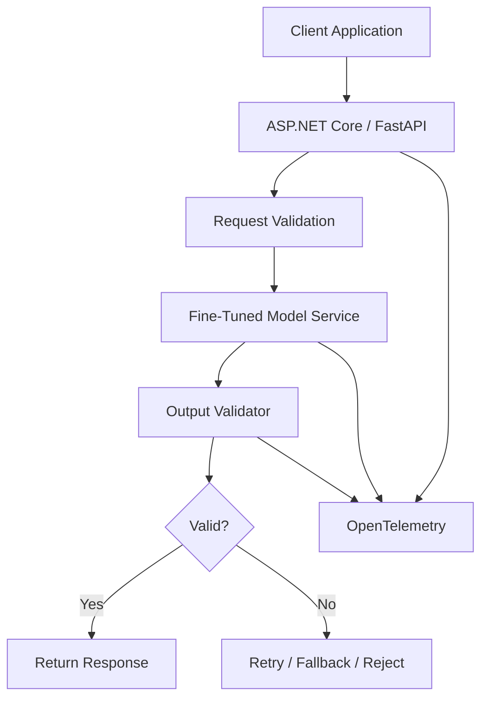

Possible serving options:

- vLLM,
- Hugging Face TGI,
- llama.cpp for supported local scenarios,
- managed inference platforms,
- containerized GPU inference on Kubernetes.

---

# 27. Runtime Output Validation

Fine-tuning does not remove the need for deterministic validation.

Production design should still validate model output.

```text
LLM Output
   │
   ▼
JSON Parser
   │
   ▼
JSON Schema Validator
   │
   ▼
Business Rule Validator
   │
   ▼
Accepted Response
```

For a tool-calling system:

```text
Model Tool Call
   │
   ▼
Tool Allowlist
   │
   ▼
Parameter Schema
   │
   ▼
Authorization Check
   │
   ▼
Business Validation
   │
   ▼
Tool Execution
```

The model should never directly bypass application controls.

---

# 28. Monitoring and Observability

Production monitoring should capture both operational and model-quality signals.

## Operational metrics

- requests per second,
- latency,
- GPU utilization,
- GPU memory,
- queue depth,
- timeouts,
- retry rate,
- inference errors,
- model-loading failures.

## Quality metrics

- invalid JSON rate,
- schema violation rate,
- tool-call failure rate,
- refusal rate,
- fallback rate,
- human correction rate,
- low-confidence / ambiguous input rate,
- distribution drift.

Architecture:

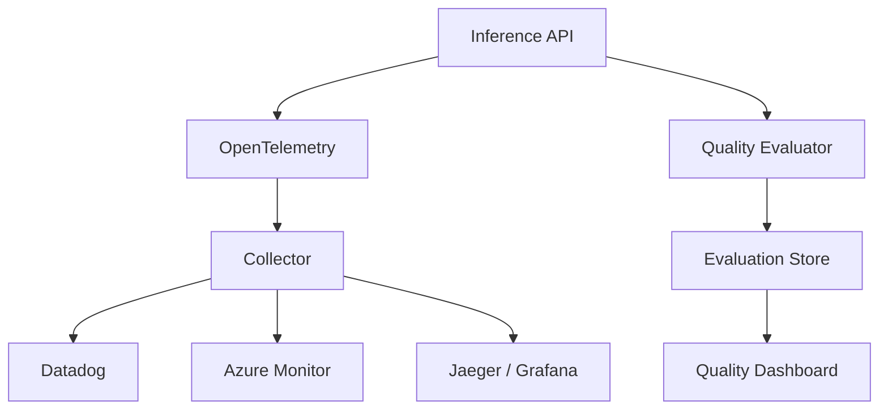

---

# 29. Continuous Evaluation

Fine-tuned models should not be considered permanently correct.

Production inputs change.

A continuous evaluation loop should be created:

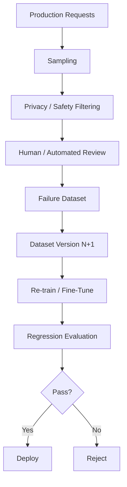

This converts fine-tuning from a one-time experiment into a repeatable MLOps process.

---

# 30. CI/CD Design

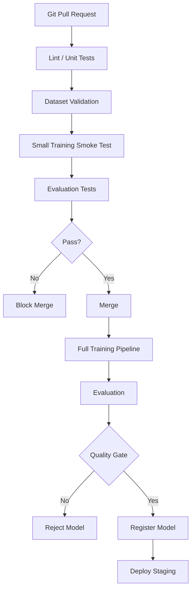

Full GPU training usually should not run on every small code change. A smaller smoke-training job can validate the pipeline in pull requests, while full training is triggered deliberately or on dataset/model version changes.

---

# 31. Suggested Repository Structure

```text
llm-finetuning-project/
│
├── README.md
├── pyproject.toml
├── requirements.txt
│
├── configs/
│   ├── sft_qlora.yaml
│   ├── sft_lora.yaml
│   ├── dpo.yaml
│   └── evaluation.yaml
│
├── data/
│   ├── raw/
│   ├── processed/
│   ├── preference/
│   └── golden_test/
│
├── src/
│   ├── data/
│   │   ├── build_dataset.py
│   │   ├── validate_dataset.py
│   │   ├── split_dataset.py
│   │   └── build_preferences.py
│   │
│   ├── training/
│   │   ├── train_sft.py
│   │   ├── train_dpo.py
│   │   └── peft_config.py
│   │
│   ├── evaluation/
│   │   ├── evaluate.py
│   │   ├── json_metrics.py
│   │   ├── tool_metrics.py
│   │   └── refusal_metrics.py
│   │
│   ├── inference/
│   │   ├── model.py
│   │   ├── validation.py
│   │   └── api.py
│   │
│   └── observability/
│       ├── telemetry.py
│       └── metrics.py
│
├── tests/
│   ├── test_dataset.py
│   ├── test_schema.py
│   ├── test_metrics.py
│   └── test_inference.py
│
├── notebooks/
│   └── exploratory_analysis.ipynb
│
├── reports/
│   ├── baseline_results.md
│   ├── sft_results.md
│   ├── dpo_results.md
│   └── final_report.md
│
├── docker/
│   └── Dockerfile
│
└── pipelines/
    ├── azure-pipelines.yml
    └── github-actions.yml
```

---

# 32. Recommended Technology Stack

| Area | Technology |
|---|---|
| Language | Python |
| Base model | Qwen3-8B or another suitable open model |
| Model framework | PyTorch |
| Model loading | Hugging Face Transformers |
| Dataset management | Hugging Face Datasets |
| PEFT | Hugging Face PEFT |
| SFT / DPO | Hugging Face TRL |
| Config-driven training | Axolotl |
| Quantization | bitsandbytes / supported quantization stack |
| Distributed execution | Accelerate / FSDP / DeepSpeed where required |
| Experiment tracking | MLflow / Weights & Biases |
| Validation | Pydantic / JSON Schema |
| API | FastAPI |
| Serving | vLLM / TGI / managed inference |
| Container | Docker |
| Orchestration | Kubernetes / AKS |
| CI/CD | GitHub Actions / Azure DevOps |
| Observability | OpenTelemetry |
| Monitoring | Datadog / Azure Monitor / Grafana |
| Optional managed GPU platform | Fireworks AI or another GPU training provider |

---

# 33. Hardware Strategy

A staged hardware strategy is recommended.

## Development

Use a small model to verify:

- dataset loading,
- formatting,
- trainer configuration,
- checkpointing,
- evaluation,
- metrics,
- experiment tracking.

## Fine-Tuning

Use GPU hardware appropriate to:

- model size,
- quantization,
- sequence length,
- effective batch size,
- training method.

QLoRA can significantly reduce memory requirements, making experiments possible on smaller GPU configurations than full fine-tuning.

However, hardware sizing should be benchmarked rather than assumed.

Record:

```text
GPU:
VRAM:
Model:
Quantization:
Sequence Length:
Micro Batch:
Gradient Accumulation:
Peak VRAM:
Tokens / second:
Total Training Time:
```

---

# 34. Error Analysis

One of the most important portfolio deliverables is a failure-analysis section.

Example failure categories:

```text
Failures
 │
 ├── Invalid JSON
 ├── Missing Required Field
 ├── Hallucinated Field
 ├── Wrong Tool
 ├── Correct Tool / Wrong Parameter
 ├── Incorrect Date Normalization
 ├── False Refusal
 ├── Failed Refusal
 ├── Long Context Failure
 └── Ambiguous Input Failure
```

For each major failure type, record:

1. representative example,
2. root cause hypothesis,
3. dataset coverage,
4. training adjustment,
5. re-evaluation result.

---

# 35. Example Iteration Story

A strong project write-up might contain an experiment narrative such as:

```text
Experiment 1
QLoRA rank 8
Result:
- good training loss
- date extraction remained weak

Analysis:
Training dataset contained insufficient examples with relative dates.

Action:
Added 450 carefully verified date-normalization examples.

Experiment 2
QLoRA rank 16
Result:
- date accuracy improved
- validation loss stable
- JSON validity increased

Remaining issue:
Model overused null instead of requesting clarification.

Action:
Added explicit ambiguity + clarification cases.

Experiment 3
SFT + DPO
Result:
Preference optimization reduced unwanted null values and
improved clarification behavior.
```

This type of troubleshooting narrative is often more valuable than presenting only the final successful result.

---

# 36. Security and Safety Design

Fine-tuning does not replace application security.

The system should include:

- input validation,
- output validation,
- tool allowlists,
- authorization,
- secret isolation,
- rate limiting,
- audit logging,
- prompt-injection testing,
- PII handling,
- data retention controls,
- dataset provenance,
- licensing review.

Training data should never contain secrets or sensitive data without appropriate governance.

---

# 37. Model Versioning

Every model artifact should be traceable.

Example:

```text
Model Version
    │
    ├── Base Model SHA / Revision
    ├── Dataset Version
    ├── Code Commit
    ├── Training Config
    ├── Adapter Weights
    ├── Evaluation Report
    └── Deployment Version
```

Example tag:

```text
structured-extractor-qwen3-8b-sft-dpo-v1.2.0
```

---

# 38. Acceptance Criteria

The project is considered complete when:

- [ ] A clearly defined task exists.
- [ ] Prompt-engineered baseline results are recorded.
- [ ] Fine-tuning is justified by measurable baseline gaps.
- [ ] Dataset contains at least several thousand validated examples.
- [ ] Dataset quality checks are automated.
- [ ] Train/validation/test leakage is prevented.
- [ ] SFT using LoRA or QLoRA is reproducible.
- [ ] Training and validation curves are recorded.
- [ ] SFT outperforms the prompted baseline on target metrics.
- [ ] Preference pairs are created.
- [ ] DPO training is completed.
- [ ] DPO is compared against the SFT checkpoint.
- [ ] Error analysis is documented.
- [ ] Model artifacts are versioned.
- [ ] An inference API is available.
- [ ] Runtime schema validation is implemented.
- [ ] Monitoring is implemented.
- [ ] A final before/after technical report is produced.

---

# 39. Key Portfolio Deliverables

The GitHub project should ideally include:

### 1. Architecture diagram

Clearly explain the data, training, evaluation, deployment, and monitoring layers.

### 2. Dataset card

Document:

- source,
- size,
- fields,
- preprocessing,
- quality rules,
- limitations,
- license,
- train/test split.

### 3. Baseline report

Show the best prompted base-model performance.

### 4. SFT report

Show:

- configuration,
- training curve,
- GPU usage,
- evaluation metrics.

### 5. DPO report

Show:

- preference-data construction,
- chosen/rejected examples,
- DPO configuration,
- incremental quality change.

### 6. Comparison dashboard

Compare:

```text
Base → Prompted → SFT → DPO
```

### 7. Failure analysis

Show real examples of problems and how they were addressed.

### 8. API demo

Demonstrate model inference through FastAPI or another production service.

### 9. Reproducible configuration

Include training configuration files and environment setup.

### 10. Final technical report

Explain not only what worked, but also:

- what failed,
- why it failed,
- what changed,
- what improved,
- and what remains unresolved.

---

# 40. Final Architecture

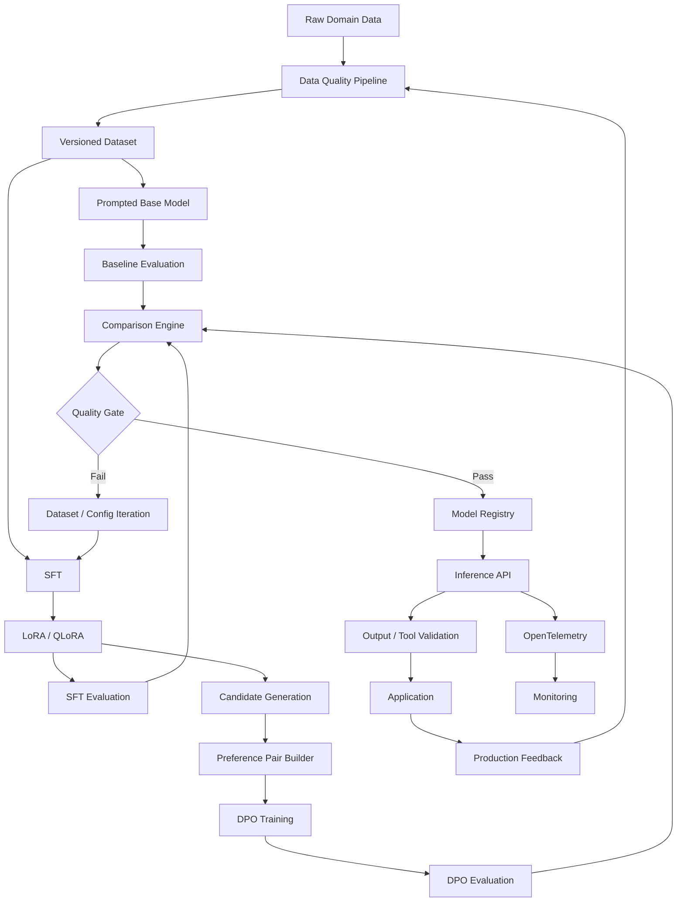

---

# 41. Project Workflow Summary

```text
Define Narrow Task
      │
      ▼
Build Strong Prompt Baseline
      │
      ▼
Measure Failure Gap
      │
      ▼
Create Clean Dataset
      │
      ▼
Validate Dataset
      │
      ▼
SFT with LoRA / QLoRA
      │
      ▼
Evaluate Held-Out Test Set
      │
      ▼
Generate Preference Pairs
      │
      ▼
DPO
      │
      ▼
Re-Evaluate
      │
      ▼
Base vs Prompt vs SFT vs DPO
      │
      ▼
Quality Gate
      │
      ▼
Register
      │
      ▼
Deploy
      │
      ▼
Monitor
      │
      ▼
Collect Failures
      │
      └────────────► Next Dataset Version
```

---

# 42. What This Project Demonstrates

Completing this project demonstrates practical knowledge of:

- LLM fine-tuning,
- post-training,
- supervised fine-tuning,
- LoRA,
- QLoRA,
- PEFT,
- quantization,
- dataset engineering,
- preference-data generation,
- DPO,
- structured generation,
- tool calling,
- model evaluation,
- refusal evaluation,
- experiment tracking,
- GPU training,
- model versioning,
- deployment,
- validation,
- observability,
- MLOps,
- and continuous model improvement.

Most importantly, it demonstrates the ability to answer the engineering question:

> Did fine-tuning actually improve the system enough to justify the additional complexity?

That evidence-based approach is what turns the project from a fine-tuning demo into a credible production AI engineering portfolio project.

---

# 43. Suggested README Summary

## Production LLM Fine-Tuning with SFT, QLoRA and DPO

This project builds an end-to-end post-training pipeline for improving an open-source LLM on a narrowly defined structured-generation task.

The system first establishes a strong prompt-engineered baseline and measures remaining failure modes. A clean, versioned dataset is then used to perform supervised fine-tuning using LoRA/QLoRA. The resulting checkpoint is further optimized using Direct Preference Optimization (DPO) with chosen/rejected response pairs.

The project evaluates each stage using deterministic metrics such as JSON validity, schema compliance, exact-match accuracy, tool-selection accuracy, parameter accuracy, and refusal correctness.

The final workflow includes experiment tracking, model versioning, quality gates, API deployment, runtime output validation, OpenTelemetry instrumentation, monitoring, and a continuous feedback loop.

The objective is not simply to fine-tune a model, but to provide measurable evidence that post-training improves a specific production task beyond what careful prompt engineering can achieve.

---

# 44. Recommended Implementation Milestones

## Milestone 1 — Problem Definition

- Choose JSON extraction or tool calling.
- Define schema.
- Define business rules.
- Define measurable acceptance criteria.

## Milestone 2 — Baseline

- Select base model.
- Engineer best prompt.
- Build golden test set.
- Measure baseline.

## Milestone 3 — Dataset

- Collect 2,000–10,000 examples.
- Normalize.
- Validate.
- Remove duplicates.
- Split dataset.

## Milestone 4 — SFT

- Configure LoRA/QLoRA.
- Train.
- Record curves.
- Evaluate.
- Perform error analysis.

## Milestone 5 — Preference Data

- Generate multiple model outputs.
- Rank outputs.
- Build chosen/rejected pairs.
- Validate preference dataset.

## Milestone 6 — DPO

- Start from SFT checkpoint.
- Train with DPO.
- Re-evaluate.
- Measure incremental improvement.

## Milestone 7 — Deployment

- Register successful model.
- Expose inference API.
- Add deterministic validation.
- Containerize.
- Deploy.

## Milestone 8 — Observability

- Add OpenTelemetry.
- Track latency and failures.
- Track structured-output quality.
- Build dashboards.

## Milestone 9 — Technical Report

Include:

- architecture,
- dataset statistics,
- baseline,
- training configurations,
- training curves,
- evaluation results,
- error analysis,
- failed experiments,
- final conclusions.

---

# 45. Key Principle

The project should always preserve the following sequence:

```text
Measure
   ↓
Fine-Tune
   ↓
Measure Again
   ↓
Compare
   ↓
Explain
```

Without the first measurement, improvement cannot be demonstrated.

Without the second measurement, fine-tuning is only an implementation exercise.

Without comparison and failure analysis, the project does not demonstrate engineering judgment.

The strongest version of this project therefore presents fine-tuning as a **controlled, measurable, reproducible engineering process**.
